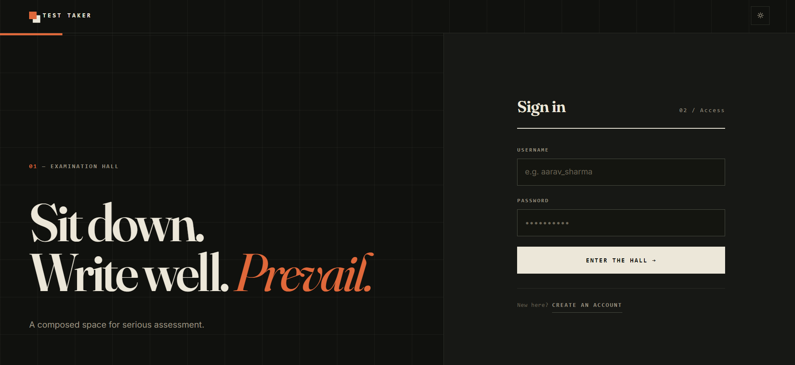
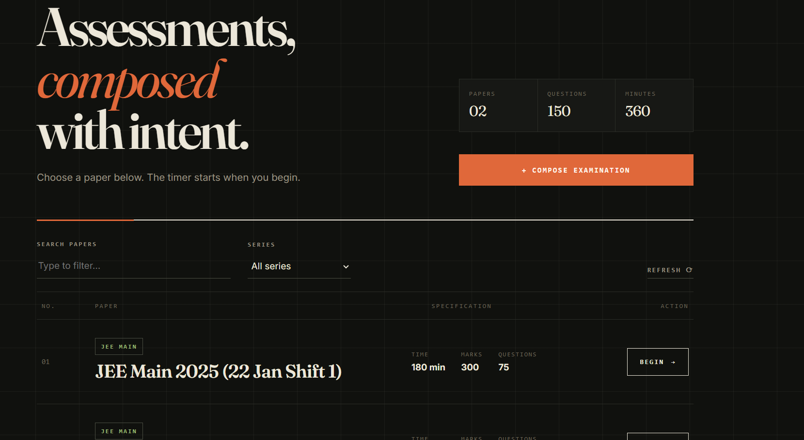
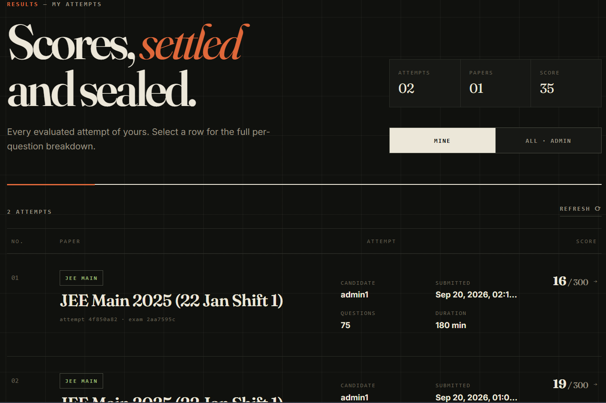
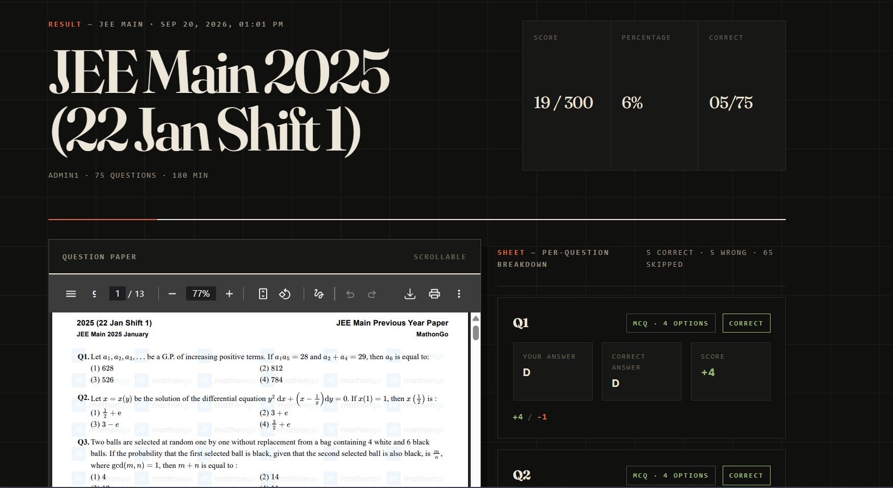
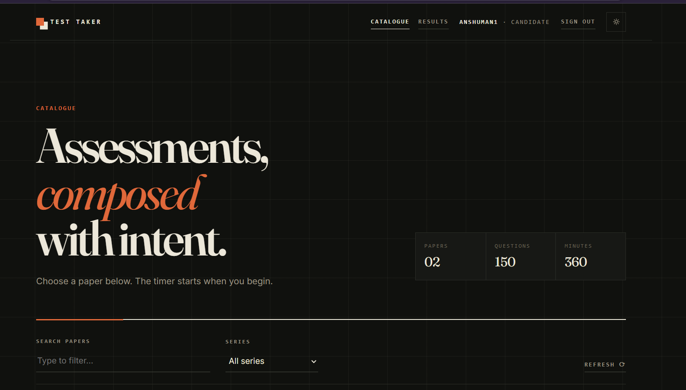
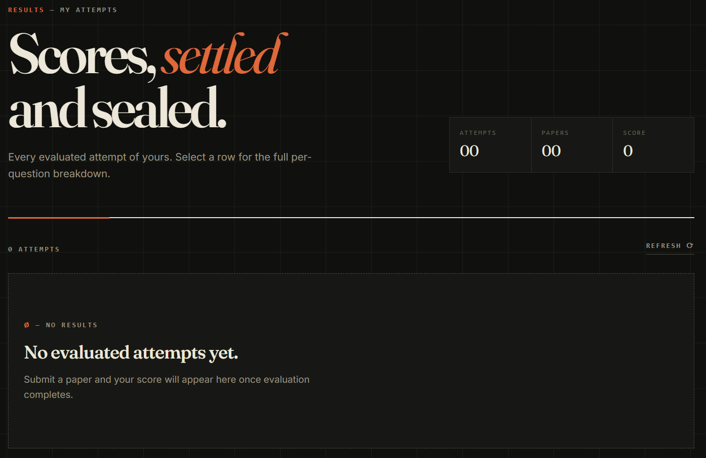

# TestTaker

TestTaker is a small exam app built with FastAPI on the backend and React on the frontend. An admin uploads a question paper as a PDF along with a CSV answer key. Candidates sign in, pick an exam from the catalog, answer under a timer, submit, and check scores later.

Live demo: http://152.70.78.167:8000/

## How this was built

The frontend was generated in full by Muse Spark 1.3. The backend was written from scratch by hand, without model generated code.

That split was deliberate. The work here went into the FastAPI backend: password storage, session handling, per route authorization, SQLite transactions, double start races, submit idempotency, API shape, and error paths. The frontend exists so the backend can be clicked through and tested. It works, but it looks generated. Titles and copy such as "Sit down. Write well. Prevail." came out of the model and were left as they were. That is a known limitation, not something the project tries to hide.

## Screens

Sign in:



Exam catalog with search and start:



Results list for evaluated attempts:



Result detail with per question breakdown and the paper alongside:



Candidate view. The catalog hides the compose button, and the results page lists only the candidate's own attempts, with no all results toggle:





## What each side does

The backend owns exam data, timing, and scoring. It stores users, exam metadata, answer keys, attempts, and submissions in SQLite. The frontend is a single page in `frontend/src/App.tsx` that handles sign in, the catalog, the exam screen, and results. It never receives correct answers before submission. The question list endpoint only sends scores, question types, and option counts.

Exams support two question types. MCQ answers are stored as letters and shown as A, B, C, D based on the option count. Descriptive answers are typed into a text box. The CSV format is visible in `sample_answer_key.csv`.

## How an exam runs

A candidate signs up and signs in, then opens the catalog. Starting an exam creates an attempt with a server start time and expiry time. If the candidate clicks start again before expiry, the backend returns the same open attempt instead of making a new one.

During the attempt the frontend fetches the PDF and the question list. Answers stay in browser state while the candidate works. Submit sends the filled answers to the backend. Scoring happens afterwards through a separate evaluator script. Until that script runs, the attempt stays pending and does not appear in results. The results page then shows the total score plus per question detail: what was answered, what was correct, and how each question scored.

Admins follow a different path. They upload the PDF and CSV, review the parsed answers in the UI, and publish. They can also edit exam metadata and answers, delete exams, and look at every candidate result. Candidates can only see their own results.

## Who can do what

Admin status comes from a name set on the server. A normal signed in user can list exams, start and submit their own attempts, fetch their own papers, and read their own results. Upload, update, delete, reading stored answer keys, and reading all results need admin. Attempt PDFs and result detail are also owner checked, so a candidate cannot open another candidate attempt by guessing the id.

## Running it

Setup installs both sides:

```
bash scripts/setup_app.sh
```

For local work the script starts the API and the Vite dev server at the same time:

```
bash scripts/start_local.sh
```

In that mode the frontend proxies `/api` to `http://127.0.0.1:8000`, so the React app can keep using relative paths.

For a single server setup, build the frontend and let FastAPI serve it:

```
bash scripts/start_public.sh
```

That script runs `npm run build` in `frontend`, then starts uvicorn on port 8000. When `frontend/dist` exists, the backend serves the built assets and returns `index.html` at `/`. API routes stay under `/api`, with a health check at `/api/health`.

## Layout

```
backend/main.py            app setup, /api router, static mount for the built frontend
backend/routers/           thin HTTP layer for auth, catalog, attempts, results
backend/services/          database access and exam rules
backend/schemas/           request and response validation
backend/database.py        SQLite table setup
backend/scripts/evaluater.py  marks submitted attempts
backend/exams/             stored PDFs, named by exam id
frontend/src/App.tsx       all screens and API calls
scripts/                   setup and start helpers
```

Submitted answers are final once stored. There is no re submit after the submission time is set. If an attempt expires without submission, the backend rejects late fetches and submits apart from a short grace window on submit.
